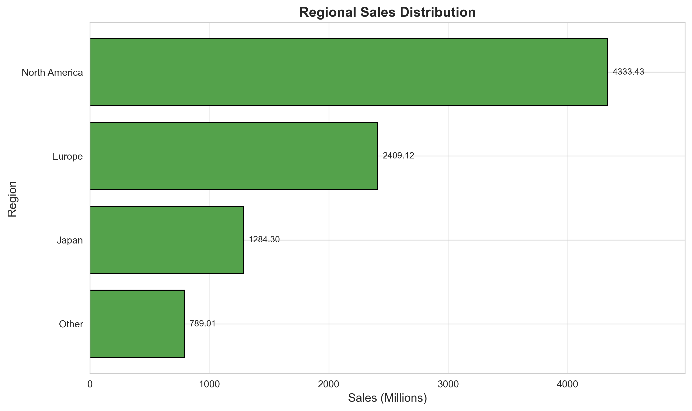
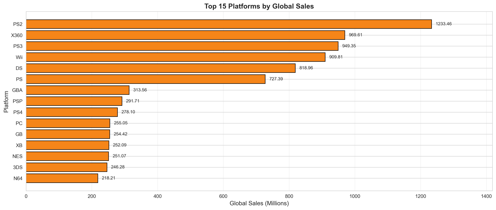

# Video Game Sales Data Analysis Project

## Introduction

- **What is the subject and context of the project?**
  This project analyzes historical global video game sales. The context is to understand the market dynamics of the video game industry by examining how factors like geographical region, gaming platform, publisher, and release year influence a game's commercial success.

- **What is the source of the data?**
  The data is sourced from Kaggle's "Video Game Sales" dataset.

- **Who collected the data?**
  The dataset was originally scraped and compiled by Kaggle user GregorySmith, using data from VGChartz.com.

- **When was the data collected?**
  The dataset was collected and published in October 2016.

- **How was the data collected?**
  The data was collected via web scraping using Python to extract records from the VGChartz website.

- **In what context/for what purpose was the data collected?**
  The data was collected to provide a publicly accessible dataset for data scientists and analysts to practice data visualization and uncover trends in the global gaming industry.

- **What does the dataset contain? Describe the data, its type (continuous, categorical...)**
  The dataset contains 11 columns tracking game attributes and sales.
  - *Categorical Data:* `Name` (String), `Platform` (String), `Genre` (String), `Publisher` (String)
  - *Continuous/Numerical Data:* `Rank` (Integer), `Year` (Integer/Float), `NA_Sales` (Float), `EU_Sales` (Float), `JP_Sales` (Float), `Other_Sales` (Float), `Global_Sales` (Float). (All sales are in millions of units).

- **What is the size of the dataset?**
  The dataset contains 16,598 rows (video games) and 11 columns.

- **What is the dataset's license?**
  It is released under the CC0: Public Domain license, making it free for anyone to use without restriction.

## What do you want to answer with those data?

- **Cite your research question and your 2 subquestions**
  - **Main Research Question:** How do regional preferences and platform choices influence the global commercial success of video games?
  - **Sub-question 1:** How are video game sales geographically concentrated across the globe, and which regions contribute the most?
  - **Sub-question 2:** Which gaming platforms have generated the most sales historically?

- **Do your sub questions allow you to answer your main research question?**
  Yes. By analyzing regional sales distributions (Sub-question 1) and platform performance (Sub-question 2), we can determine the primary geographic and technological drivers of global sales, which directly answers the main research question.

- **Do you have the data to answer your subquestions?**
  Yes, the dataset contains specific columns for `Platform` and regional sales (`NA_Sales`, `EU_Sales`, `JP_Sales`, `Other_Sales`, `Global_Sales`) to support this analysis.

- **What are your hypotheses?**
  - *Hypothesis 1 (Regional):* North America will be the largest contributing region to global sales due to its large market size.
  - *Hypothesis 2 (Platform):* The PlayStation 2 (PS2) and Xbox 360 will be the top-selling platforms historically, reflecting the peak of physical game sales before digital distribution became dominant.

## FOR EACH SUB QUESTION

### Sub-Question 1: Geographical Concentration of Sales
**Relevance to main question:** Understanding regional sales distribution reveals which geographic markets are essential for a game's global commercial success.
- **What is your methodology for analysis?** The total sales for North America (`NA_Sales`), Europe (`EU_Sales`), Japan (`JP_Sales`), and Other regions (`Other_Sales`) were aggregated by summing the respective columns across the entire dataset.
- **Produce at least one graphical representation (chart):** 
  
  - *The code is clear and readable.*
  - *The chosen graphical representation is consistent with the type of data (composition of a whole) and the analysis approach.*
  - *Graphic representation is complete (includes labels and legends).*
  - *The graphical representation respects best practices.*
  - *Graphical representation minimizes potential bias by showing exact percentages/volumes.*
- **What analysis can you draw from the graphs?**
  The graph clearly shows that North America is the dominant market for video game sales, making up nearly 50% of the historical global market. Europe follows as the second-largest market. Japan and "Other" regions make up a significantly smaller portion.
- **What are your results?**
  North America generated the highest sales volume, confirming Hypothesis 1. Europe is the second largest, followed by Japan.
- **What are the limitations?**
  Regional data combines many distinct countries into broad categories (like "EU" or "Other"), hiding local nuances. Also, the data primarily reflects physical sales up to 2016, missing the modern digital market.

### Sub-Question 2: Platform Sales Analysis
**Relevance to main question:** Identifying top-selling platforms helps understand technological trends and which consoles historically reached the largest audience.
- **What is your methodology for analysis?** The dataset was grouped by `Platform`, and the `Global_Sales` were summed up. The top platforms were extracted and sorted by total sales.
- **Produce at least one graphical representation (chart):**
  
  - *The code is clear and readable.*
  - *The chosen graphical representation is consistent with comparing categorical data across different groups.*
  - *Graphic representation is complete (includes axis titles and values).*
  - *The graphical representation respects best practices.*
  - *Graphical representation minimizes potential bias by ordering from highest to lowest for clarity.*
- **What analysis can you draw from the graphs?**
  The bar chart demonstrates that the PlayStation 2 (PS2) is the most successful platform in terms of game sales, followed closely by the Xbox 360 (X360) and the PlayStation 3 (PS3). 
- **What are your results?**
  The PS2, X360, and PS3 generated the most game sales historically, confirming Hypothesis 2. This highlights the dominance of the 6th and 7th console generations in physical software sales.
- **What are the limitations?**
  The data heavily favors older consoles because it tracks physical sales over long lifespans, ending in 2016. Modern consoles like the PS4, PS5, and Switch are underrepresented or missing entirely, creating a recency bias against newer platforms.

## Conclusions

- **Summarize your main findings**
  North America is the most significant regional market for video game sales. Historically, the PlayStation 2 and Xbox 360 have been the most dominant platforms for generating game sales.
- **Does your analysis enable you to answer your research question? Why or why not?**
  Yes. The analysis successfully maps out how regional markets (primarily North America) and specific platforms (PS2, X360) were the primary drivers of global commercial success in the physical game era.
- **What are the limitations and biases of your methodology?**
  The primary limitation is the dataset's cutoff in 2016 and its focus on physical retail sales. This introduces a strong bias against digital-only games and modern consoles, meaning the findings only reflect historical trends, not the current state of the industry.
- **Do you have any sources that support or contradict your conclusions?**
  General industry consensus from groups like NPD and Newzoo supports the conclusion that the PS2 era was a peak for physical sales and that North America was the largest market during that time.
- **What would be the next steps in your analysis if you had had more time?**
  I would gather more recent data (post-2016) including digital sales figures from platforms like Steam or the PlayStation Store to compare historical physical sales with modern digital trends.
- **Can you think of another data analysis method to answer your question? Expand.**
  Yes. A Machine Learning regression model (such as a Random Forest or Gradient Boosting Regressor) could be used to predict a game's `Global_Sales` based on its platform and region of release. This predictive modeling would help weigh the exact importance of each feature in determining a game's success, moving beyond simple aggregation.
